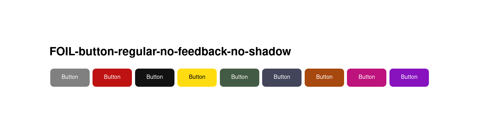

# FOIL-button

You can display buttons with the help of the FOIL-button component. Which can be used in a number of different ways. 

Here are the list of button types and parameters that can be used: 

| FOIL-button-regular                       |
| ----------------------------------------- |
| FOIL-button-regular-no-shadow             |
| FOIL-button-regular-no-feedback           |
| FOIL-button-regular-no-feedback-no-shadow |

| FOIL-button-small                       |
| --------------------------------------- |
| FOIL-button-small-no-shadow             |
| FOIL-button-small-no-feedback           |
| FOIL-button-small-no-feedback-no-shadow |

| Color Parameters                              |
| ----------------------------------------------|
| color-is-red                                  |
| color-is-yellow                               |
| color-is-green				|
| color-is-blue                                 |
| color-is-orange                               |
| color-is-purple                               |
| color-is-pink                                 |

# FOIL-button-regular (screenshot)

# FOIL-button-regular-no-shadow (screenshot)

# FOIL-button-no-feedback (screenshot)

# FOIL-button-no-feedback-no-shadow (screenshot)

# FOIL-button-regular in html

# FOIL-button-regular-no-shadow in html

# FOIL-button-regular-no-feedback in html

# FOIL-button-regular-no-feedback-no-shadow in html
