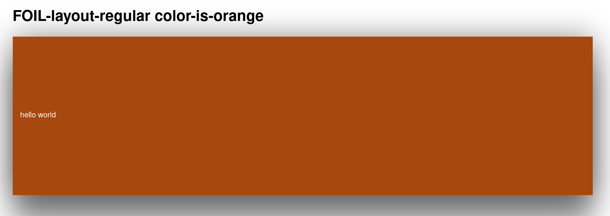
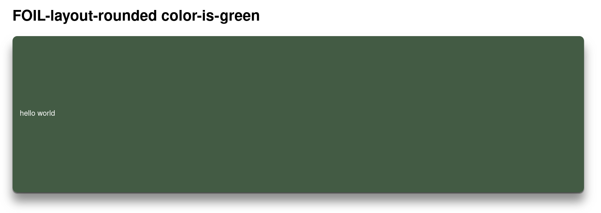

# FOIL-layout

You can display layouts with the help of the `FOIL-layout` component.

Here are the list of parameters that can be used: 

| FOIL-layout-regular                       |
| ----------------------------------------- |
| FOIL-layout-regular-no-shadow             |


| FOIL-layout-regular-rounded               |
| ----------------------------------------- |
| FOIL-layout-regular-no-shadow             |


| Layout Color Parameters                 |
| --------------------------------------- |
| color-is-red                            |
| color-is-yellow                         |
| color-is-green                          |
| color-is-blue                           |
| color-is-orange                         |

# FOIL-layout-regular


## FOIL-layout-regular (screenshot)


## FOIL-layout-regular color-is-red (screenshot)


## FOIL-layout-regular color-is-yellow (screenshot)


## FOIL-layout-regular color-is-green (screenshot)


## FOIL-layout-regular color-is-blue (screenshot)


## FOIL-layout-regular color-is-orange (screenshot)



# FOIL-layout-rounded

## FOIL-layout-rounded


## FOIL-layout-rounded-color-is-red


## FOIL-layout-rounded-color-is-yellow


## FOIL-layout-rounded-color-is-green


## FOIL-layout-rounded-color-is-orange


| How you do this in HTML Syntax?           |
| ----------------------------------------- |

`<div class="FOIL-layout-regular"></div>`

`<div class="FOIL-layout-rounded"></div>`


| Example Parameter                         |
| ----------------------------------------- |

```html
<div class="FOIL-font-styles sans-serif">
        <div class="FOIL-layout-regular color-is-orange">
                <div class="FOIL-text-header-1">
                        Hello World!
                </div>
        </div>
</div>
```
